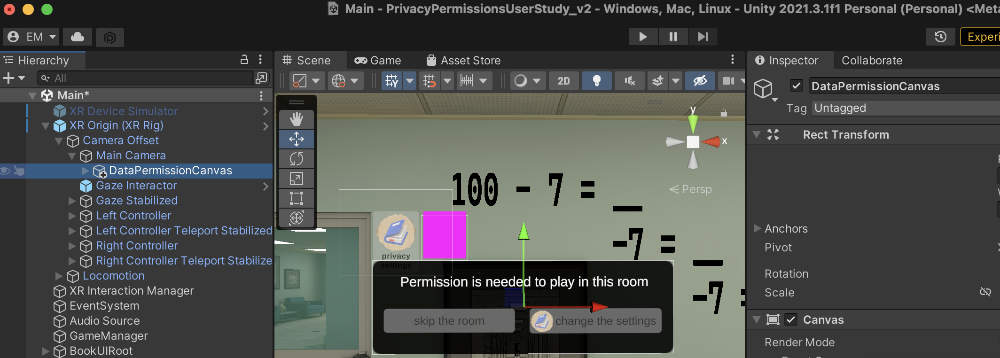
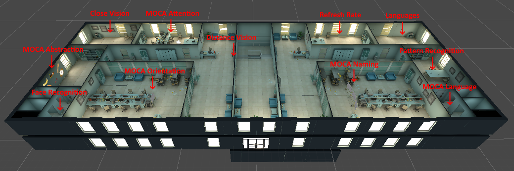

# PrivacyPermissionsUserStudy
User Study: Evaluating the effectiveness of standard and interactive permission control interfaces in virtual reality environments.

This repository builds on a public open-source virtual reality escape room game, which has been adapted and extended for the purposes of a research study. The original game serves as the baseline for our user study, exploring user privacy in immersive environments and evaluating permission control interfaces.

In this modified version, we have implemented and integrated two user interface mechanisms—a standard permission control interface and an interactive permission control interface—directly within the gameplay. Both interfaces are present in the repository, but to avoid conflicts during runtime, only one is enabled at a time via the Unity Inspector. This setup allows for controlled experimentation between the two interfaces while ensuring consistent system behavior.

For detailed information about the original escape room game, please refer to the README_escape_room_game.md file.

## Getting Started
### Installation
The repository is a Unity project built for Unity Editor version 2021.3.1f1. 

## Note

Implementation located at Assets/PrivacyNotifications

By default, the project is set to use the VR simulator in the scene. To run it with your HMD, follow these steps:

1. Go to **Edit** -> **Project Settings** -> **XR Plug-in Management**.
2. In the **XR Interaction Toolkit** section, **uncheck** "Use XR Device Simulator in scenes."

<table>
  <tr>
    <td>
      <b>Interactive UI</b> 
       
      <i>These assets are part of the interactive UI.</i> 
    </td>
  </tr>
</table>

<table>
  <tr>
    <td>
      <b>Privacy Notification</b> 
       
      <i>This notification is part of the interactive UI. If you wish to disable it, you can do so in the Unity Inspector, as shown in the image.</i> 
    </td>
  </tr>
</table>

<table>
  <tr>
    <td>
      <b>Privacy Notification</b> 
       
      <i>These assets are part of the standard UI.</i> 
    </td>
  </tr>
</table>

Additionally, there are two scripts that track the time the user spends interacting within the interface, and the data is collected based on the user's head movements. The collected data is stored in the following location: Assets/PrivacyNotifications/Data/.

It is also recommended to have Blender software installed to view the book UI.

### Controls
The following keyboard controls are available (intended for use by the researcher conducting the experiment):

`space`: teleport to next room 
`b`: teleport to previous room 
`r`: reset all rooms 
`p`: pop balloon (room #6) 
`u`: reveal letter (room #8) 
`m`: reveal letter (room #9) 
`c`: play sentence 1 (room #20) 
`v`: play sentence 2 (room #20) 

## Game Overview
 
The above figure shows an overview of the escape room building and several of the rooms contained within it. Players move from room to room within the building, completing one or more puzzles to find a "password" before moving to the next room. For this user study, certain rooms have been disabled. You can find the relevant configuration in the file: Assets/Scenes/Teleporter.cs.

